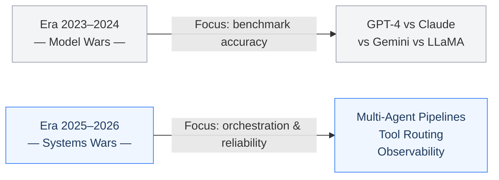
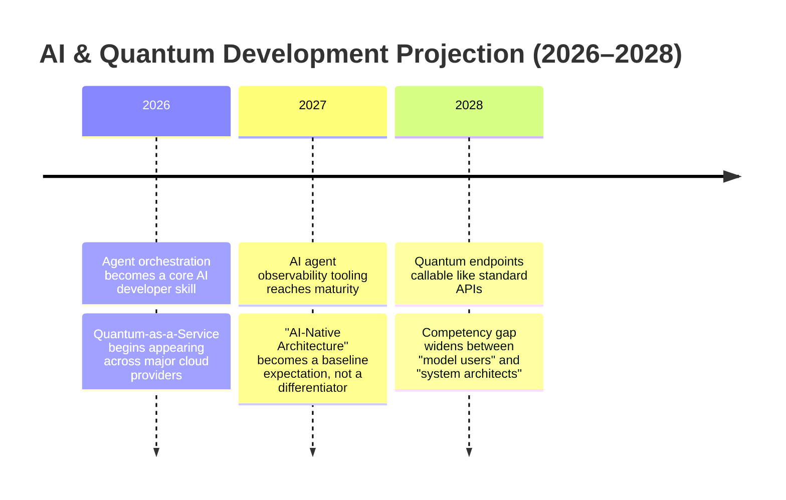

When IBM published their technology predictions for 2026, one statement stood out — not because it was provocative, but because it felt like a formal acknowledgment of something the industry has been moving toward for a while without quite saying it directly:

> *"The competition won't be on the AI models. It's a buyer's market. What matters now is orchestration."* [^1]

For those building AI systems professionally, this isn't just a trend prediction. It's a meaningful reorientation of where the real engineering challenges in this space actually live — and what that means for developers working inside it.

---

## From Model Wars to Systems Wars

For much of the past two years, the dominant conversation in AI communities revolved around a single question: which model performs best? GPT-4, Claude, Gemini, LLaMA — each new release brought new benchmarks, new comparisons, and a new cycle of re-evaluation.

IBM draws a clear line under that era. These models are now commodities. What differentiates high-quality AI products is no longer how capable the model at the center is — it's **how well the system around it is designed**: how models are routed, combined with tools, monitored in production, and composed into reliable workflows.[^1]

The implications are significant. The question that previously drove most technical decisions — *"which model is most accurate for this task?"* — needs to give way to something more architectural: *"how does this system remain reliable when the model underneath it changes, updates, or fails?"*

---

## Quantum Computing: A Real Milestone, Not Just a Headline

Alongside the orchestration narrative, IBM also announced something that deserves its own careful consideration: **2026 marks the first year a quantum computer will outperform a classical machine in real-world use cases** — not in controlled experiments, but in applied settings.[^1] IBM refers to this as *quantum advantage*, with the most significant projected impact in three domains: drug discovery, materials science, and quantitative financial optimization.[^2]

It's worth framing this accurately. Quantum computing is not replacing existing compute infrastructure wholesale. What changes is that **classes of problems previously considered computationally infeasible are beginning to open up**.

Molecular simulation for new drug development. Portfolio optimization across thousands of simultaneous variables. Large-scale logistics routing in real time. These are problem categories that have long been constrained by the limits of classical computation.

The dimension that matters most for the AI ecosystem is the emerging possibility of **quantum-accelerated model training and inference** — a frontier that is still early-stage, but the trajectory is becoming legible.[^2]

---

## Looking Ahead: A Realistic Projection

Based on the current trajectory of these developments, here is how I expect the landscape to shift over the next two years:

A few points from this projection that I find most credible:

**Agent orchestration will become the most consequential skill in AI development.** Tools like LangGraph, CrewAI, and AutoGen are already seeing real production adoption — not as experiments, but as the foundation of live systems.[^3] The ability to design robust multi-agent pipelines, define clear agent responsibilities, and keep systems predictable under varied conditions is the kind of expertise that cannot be acquired from introductory tutorials alone.

**AI observability will evolve into its own category.** Just as distributed tracing and monitoring became standard practice in the cloud era, we will see significant growth in tooling dedicated specifically to tracking agent behavior, token cost attribution, hallucination detection, and per-step latency profiling in agentic pipelines.

**Quantum-as-a-Service will enter the enterprise incrementally** — not as a general-purpose replacement, but as a specialized layer for domains where the computational scale genuinely demands it.

---

## What This Means for Developers Today

IBM's prediction specifically calls out the emergence of **agent control planes** and **multi-agent dashboards** as developments that are already taking shape.[^1] These are not speculative concepts — they are engineering requirements that surface naturally once agent-based systems move into production environments.

For developers with backgrounds in distributed systems or microservices, this transition will feel recognizable. The core challenges are not unlike those in service-oriented architectures: ensuring that parallel units of work remain consistent, are fully observable, and handle failures gracefully. The difference is that those units are now agents capable of reasoning.

This means **the systems-level expertise that was traditionally considered "pure backend" work is becoming increasingly central to AI engineering** — and that represents a real opportunity for developers willing to move in that direction.

---

## Closing Perspective

The core takeaway is straightforward: **the focus has shifted from selecting the best model to designing the best system**. Models will continue to be updated, swapped, and combined. A system designed around sound architectural principles is the more durable investment.

Progress in this field doesn't always come from a larger model. More often than not, it comes from a more thoughtful architecture.

---

### References

[^1]: IBM Think — *The Trends That Will Shape AI and Tech in 2026* (March 2026): https://www.ibm.com/think/news/ai-tech-trends-predictions-2026
[^2]: IBM Research — *Quantum Computing Roadmap*: https://research.ibm.com/quantum-computing
[^3]: LangChain Blog — *The State of AI Agents 2026*: https://blog.langchain.dev
