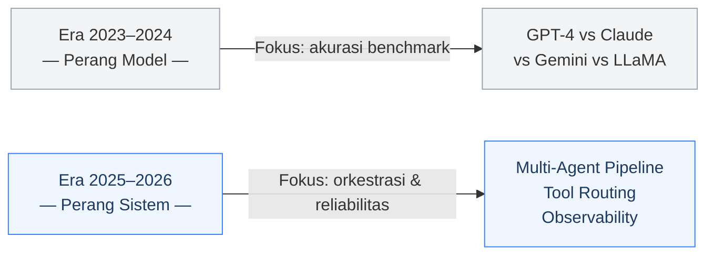
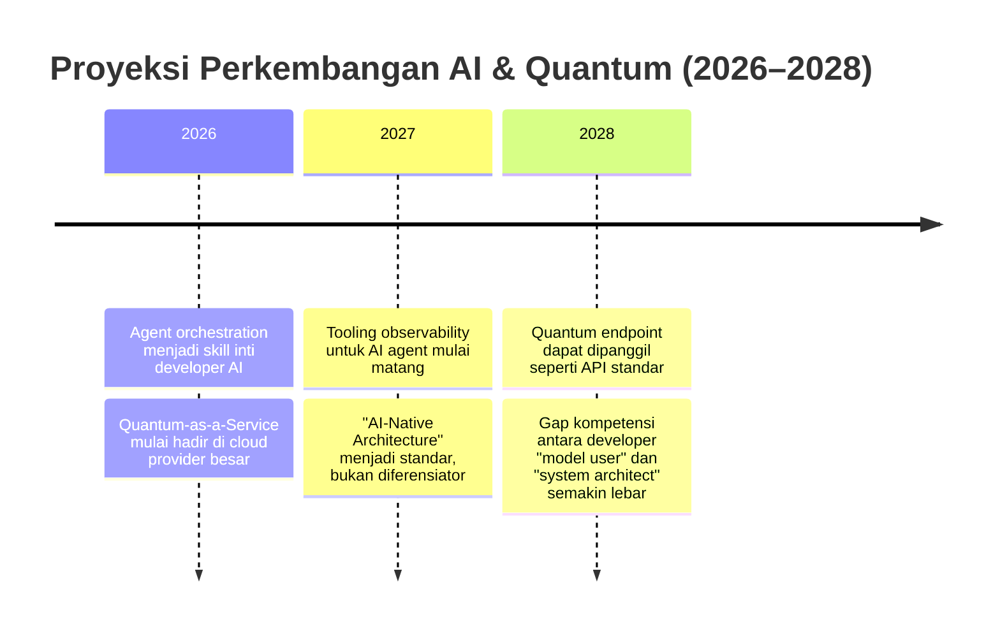

Ketika IBM mempublikasikan prediksi teknologi mereka untuk 2026, ada satu pernyataan yang cukup mencolok — bukan karena provokatif, tapi karena terasa seperti sesuatu yang sudah lama terjadi namun baru sekarang diakui secara terbuka:

> *"The competition won't be on the AI models. It's a buyer's market. What matters now is orchestration."* [^1]

Bagi saya, ini bukan sekadar prediksi tren tahunan. Ini pergeseran cara pandang yang cukup fundamental tentang ke mana arah industri ini berjalan — dan apa artinya bagi developer yang bekerja di dalamnya.

---

## Dari Perang Model ke Perang Sistem

Dua tahun terakhir, sebagian besar diskusi di komunitas AI berputar di pertanyaan yang sama: model mana yang paling unggul? GPT-4, Claude, Gemini, LLaMA — semuanya berlomba di benchmark yang semakin ketat. Dan kita, sebagai developer, ikut terbawa arus itu.

IBM mengakhiri perdebatan itu dengan cukup lugas. Model-model tersebut kini sudah menjadi komoditas. Yang membedakan produk dan sistem AI berkualitas tinggi bukan lagi seberapa pintar model di dalamnya, melainkan **seberapa baik sistem di sekitarnya dirancang** — bagaimana model dipanggil, dirutekan, dimonitor, dan digabungkan dengan tools lain.[^1]

Implikasinya cukup signifikan. Pertanyaan yang dulu menjadi prioritas — *"model mana yang paling akurat untuk tugas ini?"* — kini perlu digantikan dengan pertanyaan yang lebih arsitektural: *"bagaimana sistem ini tetap berfungsi dengan baik ketika model di dalamnya diganti, diperbarui, atau gagal?"*

---

## Quantum Computing: Milestone Nyata, Bukan Sekadar Headline

Di sisi lain, IBM juga mengumumkan sesuatu yang cukup bersejarah: **2026 adalah tahun pertama quantum computer akan melampaui komputer klasik dalam kasus penggunaan nyata**, bukan sekadar eksperimen laboratorium yang terkontrol.[^1] IBM menyebutnya sebagai *quantum advantage*, dengan proyeksi dampak terbesar di tiga domain: drug discovery, materials science, dan optimasi keuangan kuantitatif.[^2]

Penting untuk menempatkan ini dalam konteks yang tepat. Quantum computing tidak akan menggantikan infrastruktur komputasi yang ada sekarang secara keseluruhan. Yang berubah adalah: **masalah-masalah yang sebelumnya dianggap tidak feasible secara komputasi kini mulai bisa diselesaikan**.

Simulasi molekul untuk pengembangan obat baru. Optimasi portofolio dengan ribuan variabel simultan. Kalkulasi rute logistik skala besar secara real-time. Semua ini adalah kelas masalah yang selama ini dibatasi oleh kapasitas komputasi klasik.

Yang lebih menarik lagi bagi ekosistem AI adalah kemungkinan **inferensi dan training model yang memanfaatkan quantum acceleration** — sebuah frontier yang masih sangat awal, namun arahnya sudah mulai terlihat jelas.[^2]

---

## Proyeksi ke Depan

Berdasarkan tren yang ada, ini adalah peta perkembangan yang saya perkirakan akan terjadi dalam dua tahun ke depan:

Beberapa poin yang saya anggap paling kredibel dari proyeksi ini:

Pertama, **agent orchestration akan menjadi skill yang paling dicari** di antara developer AI. Tools seperti LangGraph, CrewAI, dan AutoGen sudah menunjukkan traksi yang nyata — bukan sebagai eksperimen, tapi sebagai fondasi sistem produksi.[^3] Kemampuan merancang multi-agent pipeline yang robust, menentukan batas tanggung jawab antar agent, dan memastikan sistem tetap *predictable* adalah jenis keahlian yang tidak bisa dipelajari hanya dari tutorial dasar.

Kedua, **AI observability akan berkembang menjadi kategori tersendiri**. Sama seperti monitoring dan distributed tracing menjadi standar di era cloud, kita akan melihat pertumbuhan signifikan pada tools yang khusus menangani pemantauan agent behavior, pelacakan biaya token, deteksi hallucination, dan analisis latency per langkah pipeline.

Ketiga, **Quantum-as-a-Service akan mulai masuk ke enterprise** secara bertahap — bukan sebagai solusi universal, melainkan sebagai layanan khusus untuk domain tertentu yang memang membutuhkan komputasi skala besar.

---

## Relevansinya bagi Developer Hari Ini

IBM secara spesifik menyebutkan munculnya **agent control plane** dan **multi-agent dashboard** sebagai perkembangan nyata yang sedang terjadi.[^1] Ini bukan konsep futuristik — ini adalah kebutuhan engineering yang muncul ketika sistem berbasis agent mulai masuk ke lingkungan produksi.

Bagi developer yang memiliki latar belakang di distributed systems atau microservices, transisi ini akan terasa familiar. Tantangannya bukan jauh berbeda: bagaimana memastikan unit-unit yang bekerja secara paralel tetap konsisten, bisa dipantau, dan gracefully menangani kegagalan. Bedanya, unit-unit tersebut sekarang adalah agent yang dapat melakukan reasoning.

Artinya, **keahlian sistem yang selama ini dianggap "backend murni" kini menjadi semakin relevan di ranah AI** — dan ini adalah peluang yang nyata bagi developer yang mau mengambilnya.

---

## Penutup

Pesan utama dari semua ini cukup sederhana: **fokus bergeser dari memilih model terbaik ke merancang sistem terbaik**. Model akan terus diperbarui, dipertukarkan, dan dikombinasikan. Sistem yang dirancang dengan prinsip yang solid adalah aset jangka panjang yang sesungguhnya.

Bagi saya, ini adalah pengingat bahwa kemajuan di bidang ini tidak selalu datang dari model yang lebih besar — tapi seringkali dari arsitektur yang lebih cermat.

---

### Referensi

[^1]: IBM Think — *The Trends That Will Shape AI and Tech in 2026* (Maret 2026): https://www.ibm.com/think/news/ai-tech-trends-predictions-2026
[^2]: IBM Research — *Quantum Computing Roadmap*: https://research.ibm.com/quantum-computing
[^3]: LangChain Blog — *The State of AI Agents 2026*: https://blog.langchain.dev
